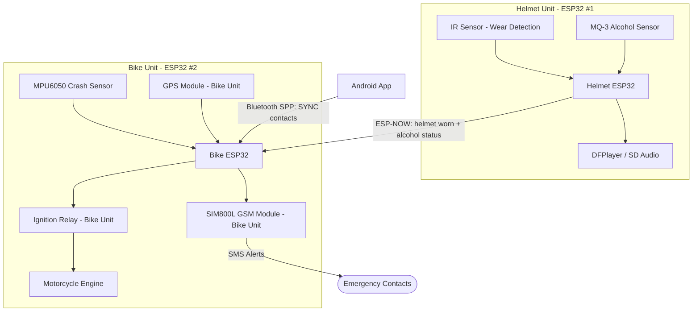

# Smart Helmet - Android App + Dual ESP32 Firmware

The system now uses two ESP32 units that communicate wirelessly. The bike unit owns the safety-critical motorcycle hardware, while the helmet unit keeps the rider-facing sensors and audio feedback.

## System Architecture

1. **Android App**: Stores emergency contacts locally and syncs them to the Bike Unit over Bluetooth Classic SPP.
2. **Helmet Unit (ESP32 #1)**: Mounted in the helmet. Contains the IR/wear sensor, MQ-3 alcohol sensor, and DFPlayer/SD audio module.
3. **Bike Unit (ESP32 #2)**: Mounted on the motorcycle. Contains the MPU6050, SIM800L GSM module, GPS module, and ignition relay module.

## Component Placement

| Unit | Components |
| --- | --- |
| Helmet Unit | Helmet ESP32, IR/wear sensor, MQ-3 alcohol sensor, DFPlayer/SD audio module |
| Bike Unit | Bike ESP32, MPU6050, SIM800L GSM module, GPS module, ignition relay module |

## Wireless Behavior

- The Helmet Unit broadcasts helmet-worn and alcohol status to the Bike Unit using built-in Wi-Fi (ESP-NOW) locked to Wi-Fi Channel 1.
- The Bike Unit enables the relay only when it receives a fresh safe status: helmet worn and alcohol not detected (1.5s status timeout).
- If the wireless status becomes stale or is lost, the Bike Unit immediately disables the relay.
- The Android app syncs emergency contacts directly to `SmartHelmet_Bike_ESP32` via Bluetooth Classic SPP. The Bike Unit parses and saves up to 10 contacts into flash memory and returns `OK` or `ERR:`.

## Helmet Unit Firmware

File: `esp32_firmware/esp32_helmet_unit.ino`

Default pins:

| Component | ESP32 Pin |
| --- | --- |
| IR / wear sensor | GPIO 4 |
| MQ-3 analog output | GPIO 34 |
| DFPlayer RX | GPIO 18 |
| DFPlayer TX | GPIO 19 |

The sketch:

- Configures built-in Wi-Fi on Channel 1 for ESP-NOW.
- Reads helmet-wear status (IR sensor).
- Reads MQ-3 alcohol sensor (threshold set to 300).
- Plays DFPlayer voice alerts:
  - **Track 1**: "Helmet not worn, please wear your helmet" (plays when helmet is not worn; ignition blocked).
  - **Track 2**: "Alcohol detected, engine blocked" (plays when alcohol level > 300; ignition blocked).
- Broadcasts safety status packets to the Bike Unit over ESP-NOW.

## Bike Unit Firmware

File: `esp32_firmware/esp32_bike_unit.ino`

Default pins:

| Component | ESP32 Pin |
| --- | --- |
| Relay module | GPIO 5 |
| SIM800L RX/TX | GPIO 16 / GPIO 17 |
| GPS RX/TX | GPIO 26 / GPIO 27 |
| MPU6050 SDA/SCL | GPIO 21 / GPIO 22 |

The sketch:

- Configures built-in Wi-Fi on Channel 1 for ESP-NOW.
- Receives helmet safety status over ESP-NOW and controls the ignition relay.
- Configures MPU6050 to ±8g full scale range (`0x1C` register = `0x10`) for accurate crash/impact detection up to 8g.
- Reads GPS NMEA location to generate Google Maps position URLs (`https://maps.google.com/?q=lat,lon`).
- Initializes SIM800L GSM module (auto-baud sync, text mode `AT+CMGF=1`, GSM charset), waits for `>` prompt, and sends SMS alerts with GPS location to all saved contacts when an impact is detected.
- Stores emergency contacts in ESP32 NVS Flash (`Preferences`).

## Bench Testing Checklist

- Confirm both ESP32 boards initialize built-in Wi-Fi on Channel 1 and print their ESP-NOW MAC addresses in Serial Monitor.
- Confirm the Bike Unit relay stays off when the Helmet Unit is powered off or disconnected.
- Confirm the relay turns on only when the helmet is worn and alcohol is below threshold.
- Tune `ALCOHOL_THRESHOLD` after MQ-3 warm-up and calibration.
- Verify MPU6050 impact detection trigger threshold (`IMPACT_G_THRESHOLD = 3.5f` on ±8g range).
- Power SIM800L from a stable external supply capable of 2A peak current (common GND with ESP32).
- Sync emergency contacts from the Android app and verify `OK` response is received by the app.
- Test SMS alert delivery with one contact before full deployment.
