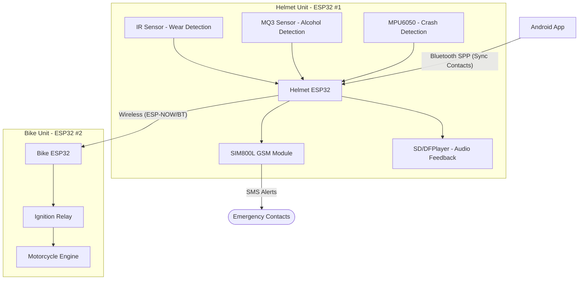

# Smart Helmet - Emergency Contacts App + ESP32 Firmware

Fully offline: no internet or SIM card needed in the phone. The app talks to the helmet's ESP32 over Bluetooth Classic (SPP), and the ESP32's own SIM800L GSM module sends the actual SMS alerts.

## System Architecture

The system consists of three main components:
1. **Android App**: Manages emergency contacts and syncs them to the helmet via Bluetooth.
2. **Helmet Unit (ESP32 #1)**: Placed inside the helmet. Contains sensors (IR sensor for helmet wear detection, MQ3 sensor for alcohol detection, MPU6050 for crash detection), the SIM800L GSM module for SMS, and an SD module/DFPlayer for audio feedback. 
3. **Bike Unit (ESP32 #2)**: Placed on the motorcycle. Contains a relay module connected to the engine ignition. It communicates with the Helmet Unit to determine if it's safe to start the engine.

### How it fits together

## Android app (`app/`)

1. Open the `SmartHelmetApp` folder in Android Studio (Giraffe or newer).
2. Let Gradle sync (it will download Compose, Room, etc.).
3. Run on a phone (min Android 8 / API 26). Requires a real device — Bluetooth doesn't work on the emulator.
4. On first launch it asks for Bluetooth permission (and Location on Android 11 and below, which the OS requires for classic Bluetooth).
5. Add contacts with the form — they save to a local Room database, no internet involved.
6. Pair your phone with the ESP32 in **Android's Bluetooth settings first** (device name will be `SmartHelmet_ESP32`, default pairing PIN is usually `1234` or `0000` for SPP boards).
7. Back in the app, tap **"Sync Contacts to Helmet"** and pick the paired ESP32 from the list. The full contact list is sent over Bluetooth.

## Helmet Unit Firmware (`esp32_firmware/esp32_helmet.ino`)

1. Open in Arduino IDE with the ESP32 board package installed.
2. Wire your SIM800L to the pins defined by `GSM_RX_PIN` / `GSM_TX_PIN` (default 16/17) — double check your board's UART availability.
3. Flash it. It starts advertising Bluetooth as `SmartHelmet_ESP32`.
4. It listens for the `SYNC:...` message from the app and saves contacts to flash (`Preferences`), so they survive reboots/power loss.
5. Sensor reading functions manage the logic:
   - `isAccidentDetected()` — MPU6050 impact/tilt logic
   - `isAlcoholDetected()` — MQ-3 threshold
   - `isHelmetWorn()` — IR wear sensor
6. If the helmet is worn and no alcohol is detected, it signals the **Bike Unit** to enable the relay for engine ignition.
7. When `isAccidentDetected()` returns true, it loops through the stored contacts and sends each one an SMS via AT commands to the SIM800L.

## Bike Unit Firmware

This unit runs a separate ESP32 that:
1. Receives the safety status from the Helmet Unit.
2. Controls a Relay Module connected to the bike's ignition system.
3. Ensures the bike can only start if the rider is wearing the helmet and is sober.

## Why Bluetooth Classic (SPP) instead of BLE

For a simple "send a batch of text data" use case like this, classic SPP is much less code on both ends — it behaves like a plain serial cable. BLE would require defining GATT services/characteristics, which is unnecessary complexity here. ESP32 supports both, but SPP is the pragmatic choice.

## Notes / things to double check before relying on this in the field

- Test the accident-detection threshold extensively on the bench — false positives/negatives matter a lot for a safety device.
- SIM800L needs a stable 2A-capable power supply (not the ESP32's onboard regulator) or it will brown out when transmitting.
- Consider adding a manual "cancel alert" button in case of a false trigger, with a short delay before the SMS actually sends.
